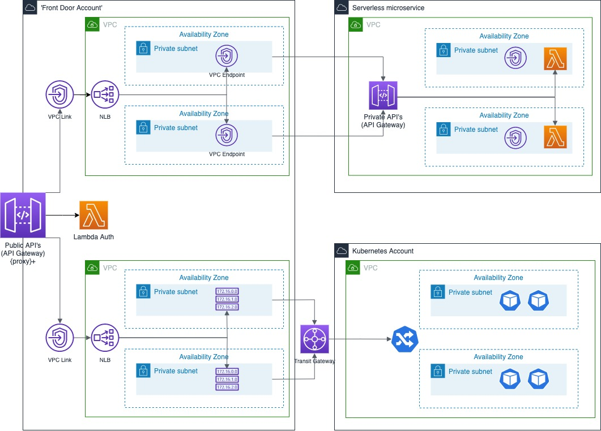

## Overview

## Deployment
1. Deploy service-apig to account 2
1. Update cfn of public-vpi-api with details from service-apig
1. Deploy public-vpc-api to account 1

1. Login to account 1 - target the NLB to the IP address of the VPCE eni
1. 

Risks calling the Serverless microservice

1. The IP address used by the ENI associated with the VPC Endpoint may change. 
This address is referenced in the target group associated with the NLB. This risk can be remediate 
by a heartbeat lambda which could update the rules or an alarm on the Cloudwatch metrics created as 
part of the NLB.
1. If the RestAPI is destroyed and recreated or the name changes then a new RestApiId may be generated.
The Endpoint URL associated with the Integration request will need to be updated at the 'Front door API' 
1. A soft limit of 20 VPC Links per account is in place. 
1. There are a number of soft limits which would need to be increased if the Front Door is
able to handle a large number of transactions.
1. Resource policies against the private API's need careful configuration.
1. Networking failures of the Front Door API calling the downstream API's will be hard to diagnose.
 
